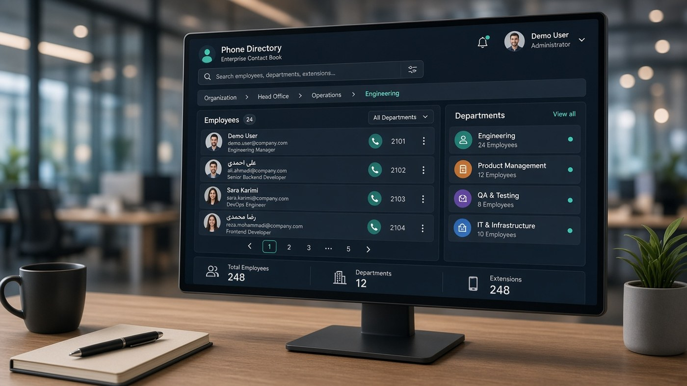

# Enterprise directory

Contacts across large organizations

  
  

  

<a href="https://www.ramioo.com/projects/enterprise-directory">https://www.ramioo.com/projects/enterprise-directory</a>

> Public product window. Source code stays private.

Interactive UI catalogs on GitHub Pages: [Atlas](https://ramincsy.github.io/atlas-showcase/) · [Taradod Nexus](https://ramincsy.github.io/taradod-nexus-showcase/)

---

### Focus

- Organization-wide phone book / directory
- Search and structure for large orgs
- Operational UI for staff, not just a static list
- Deployed as part of ramioo software portfolio

---

### فارسی

دفترچه تلفن / دایرکتوری سازمانی. ویترین عمومی؛ سورس خصوصی.

صفحهٔ معرفی پروژه: <a href="https://www.ramioo.com/projects/enterprise-directory">https://www.ramioo.com/projects/enterprise-directory</a>

---

### Links
- https://www.ramioo.com/projects/enterprise-directory
- https://www.ramioo.com/contact · ramincsywork@gmail.com · 0914 666 50 68
- Hub: https://github.com/ramincsy/ramioo-showcase
