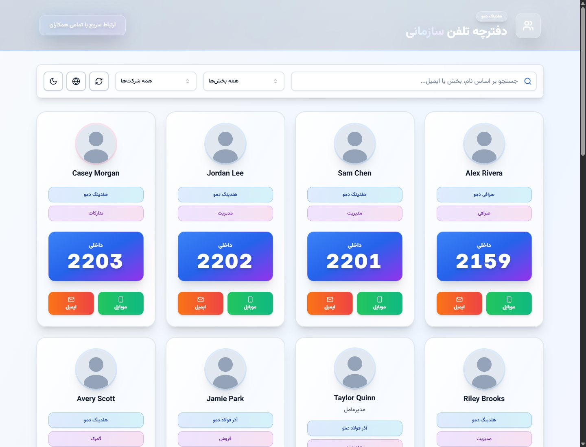

# Enterprise Directory

Who’s who across the holding — searchable, current, under IT control · چه کسی کجاست در هلدینگ

  
  
  

  

<a href="https://ramincsy.github.io/enterprise-directory-showcase/">Live catalog (GitHub Pages)</a> · <a href="https://www.ramioo.com/projects/enterprise-directory">Project page</a>

> Public product window. Source code stays private.

**Catalog language:** the [GitHub Pages tour](https://ramincsy.github.io/enterprise-directory-showcase/) is bilingual with an **EN | فارسی** toggle (default FA / RTL; last choice remembered). English and Persian are never stacked in the same visible block.

Interactive UI catalogs on GitHub Pages: [Atlas](https://ramincsy.github.io/atlas-showcase/) · [Taradod Nexus](https://ramincsy.github.io/taradod-nexus-showcase/) · [AftabPulse](https://ramincsy.github.io/aftabpulse-showcase/)

---

### Focus

- Single source of truth for employee profiles in multi-company holdings
- On-prem Persian RTL PWA — staff directory + full operator governance
- Always-current who’s-who vs stale Excel / intranet lists

---

### Key capabilities

- **Staff directory** — search & filters; photo on the card; mobile & email under privacy
- **Holding notices** — time-bounded banners where people already look
- **Usage monitoring** — views, search heat, device mix — prove the book is used
- **People ops** — companies, employees, Excel intake, photo upload + crop (max **2 MB** → WebP)
- **Backup & Restore** — one admin page (JSON export + gated Super Admin restore)
- **Security** — Authenticator 2FA, recovery codes, separate admin login

**Tour:** [18-screen catalog on GitHub Pages](https://ramincsy.github.io/enterprise-directory-showcase/)

---

### Who it’s for

Holding IT that needs a trusted who’s-who across companies — on-prem, privacy-controlled — without spreadsheets or CRM contact modules.

CTAs: [Contact](https://www.ramioo.com/contact) · [Project page](https://www.ramioo.com/projects/enterprise-directory)

---

### تمرکز

چه کسی کجاست در هلدینگ — قابل‌جستجو، به‌روز، زیر کنترل IT. آن‌پریم، فارسی و راست‌به‌چپ به‌صورت PWA. تور ۱۸ صفحه‌ای: <a href="https://ramincsy.github.io/enterprise-directory-showcase/">کاتالوگ Pages</a>.

صفحهٔ پروژه: <a href="https://www.ramioo.com/projects/enterprise-directory">https://www.ramioo.com/projects/enterprise-directory</a>

---

### Links
- https://www.ramioo.com/projects/enterprise-directory
- https://www.ramioo.com/contact · ramincsywork@gmail.com · 0914 666 50 68
- Hub: https://github.com/ramincsy/ramioo-showcase
- Pages tour: https://ramincsy.github.io/enterprise-directory-showcase/
